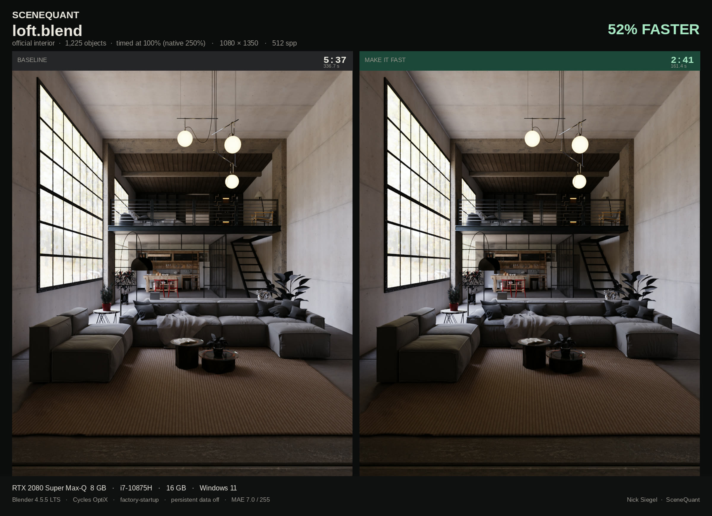
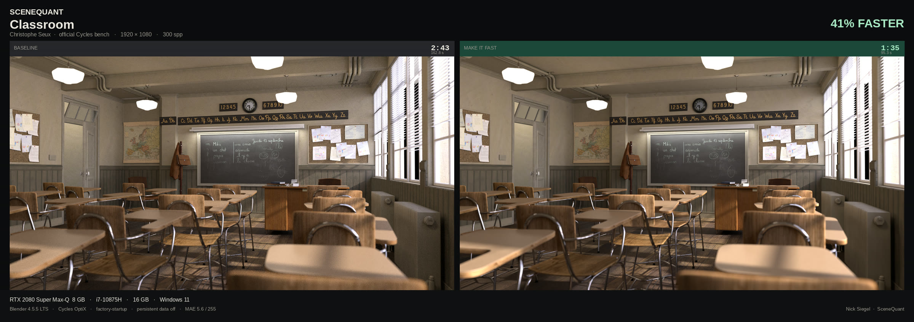
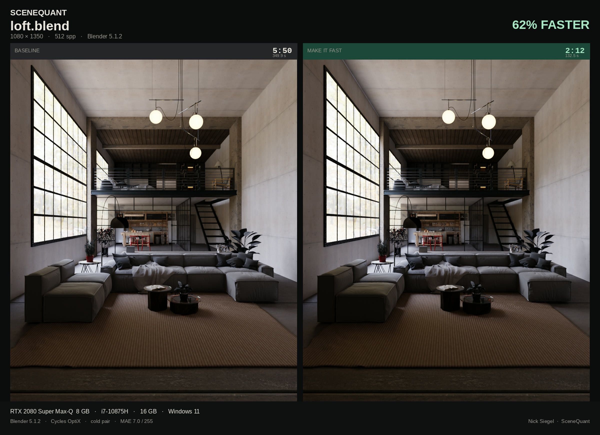

# SceneQuant

**Faster Cycles without casually changing the shot.**

Free Blender addon. Press **Analyze & Preview** — SceneQuant builds a quality-aware Cycles speed plan, shows every proposed change, and journals the accepted plan for full revert.

[Download the zip](https://github.com/liminallyspaced/ScreenQuantDev/releases/latest) · [itch.io](https://liminalvisual.itch.io/scenequant) · [Gumroad](https://8139959199815.gumroad.com/l/exyxdi)

Blender 4.2+ · GPL-3.0-or-later · Author: [Nick Siegel](https://github.com/liminallyspaced)

## Proof, not a promise

Timed on one machine, cold pair, factory-startup, persistent data off.

**Machine:** RTX 2080 Super Max-Q 8 GB · i7-10875H · 16 GB · Windows 11 · Cycles OptiX

| Scene | Blender | Res | spp | Baseline | Make it Fast | Cut |
|---|---|---|---|---|---|---|
| Classroom (Christophe Seux) | 4.5.5 LTS | 1920×1080 | 300 | 2:43 | 1:35 | **41%** |
| loft.blend | 4.5.5 LTS | 1080×1350 | 512 | 5:37 | 2:41 | **52%** |
| loft.blend | 5.1.2 | 1080×1350 | 512 | 5:50 | 2:12 | **62%** |

loft was timed at 100% (the native file is 250%). Already-tuned scenes may only move a little. These three pairs are **not** a promise for every file.

## What Analyze & Preview does

It builds a revertible speed plan for **this** scene and shows it before any render optimization is applied. The default **Preserve Look** contract covers:

- Adaptive sampling with a measured sample floor
- Three representative frame checks for video by default; the hardest frame wins
- Automatic low-resolution before/after checks for each Preserve Look action
  group; a failing group is immediately journal-rolled back
- Persistent render data when VRAM headroom is available
- GPU render/denoise/compositor placement when supported and memory-safe
- Proven no-op work such as GPU path-guiding flags and static deform motion blur

Preserve Look does **not** change lights, shadows, material response, object visibility, bounce limits, denoiser choice, or denoiser quality. In particular, it never turns OIDN on and never changes Accurate prefiltering to Fast. Draft mode, Fast GI, and resolution tricks are also excluded.

Three quality contracts are available:

- **Preserve Look** — default for final renders and video.
- **Balanced** — permits measured sampling changes, while keeping lighting, materials, visibility, and denoiser quality intact.
- **Aggressive** — explicit opt-in to the historical perceptual/culling stack.

The exact allowlist, video probe rules, and acceptance gates live in
[`docs/VIDEO-SAFE.md`](docs/VIDEO-SAFE.md).

Preserve Look now records mean, p95 and max scene-linear RGB evidence for every
action group. Mean and p95 gate acceptance; max remains diagnostic so one
firefly does not veto an otherwise identical render. Separate full-resolution
benchmark tooling records temporal residuals and break-even frame counts; see
[`docs/PRESERVE-LOOK-BENCHMARKS.md`](docs/PRESERVE-LOOK-BENCHMARKS.md).

Everything it writes goes through a journal. **Revert All** puts the scene back.

The N-panel exposes the quality contract, render intent, **Analyze & Preview**, and revert. Auto-detected video ranges use stricter multi-frame sample validation. Fit to Budget remains separate because automatic texture reduction is not part of Preserve Look.

Also in the addon: Analyze, Fit to Budget (VRAM), Probe Sample Knee, Verify Render.

## Install

1. Download `scenequant-0.3.5.zip` from [Releases](https://github.com/liminallyspaced/ScreenQuantDev/releases/latest).
2. Blender → Edit → Preferences → Add-ons → Install from Disk.
3. Enable **SceneQuant — Scene & Render Optimizer**.
4. 3D Viewport → N panel → **SceneQuant** → **Analyze & Preview**.

Do **not** install the GitHub “Source code” zip. That is the repo, not the addon.

Once it is on [extensions.blender.org](https://extensions.blender.org/), use Get Extensions instead.

## Honest limits

- These numbers are two files on one laptop. Your file will differ.
- A scene that is already well-tuned may only move a little.
- The published timing plates used the older aggressive stack and measured MAE ~5.6–7.0 / 255; they are not Preserve Look performance claims.
- The automatic visual guard is a conservative low-resolution screen, not a
  substitute for the full-resolution low-end and problem-scene benchmark gate.
- Preserve Look is a stricter policy and multi-frame sampling guard, not a promise of pixel identity on every device. Validate important shots before committing a full sequence.
- Fit to Budget is a separate VRAM tool. It is not what the 41 / 52 / 62% plates measure.

## License

GPL-3.0-or-later. See [`LICENSE`](LICENSE).
